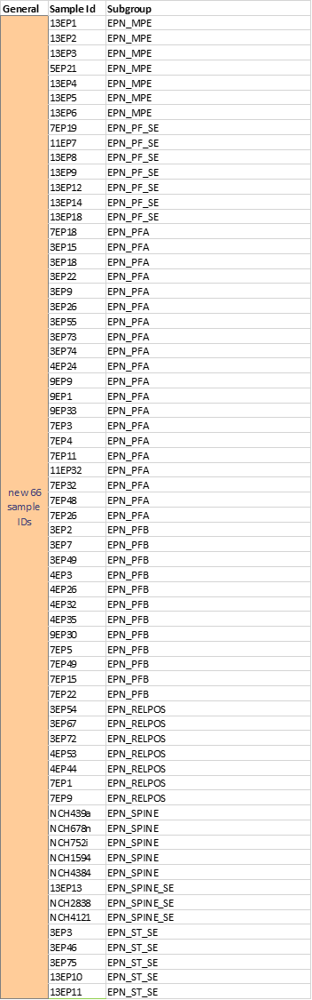
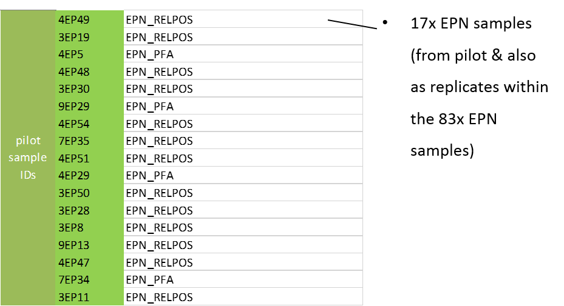
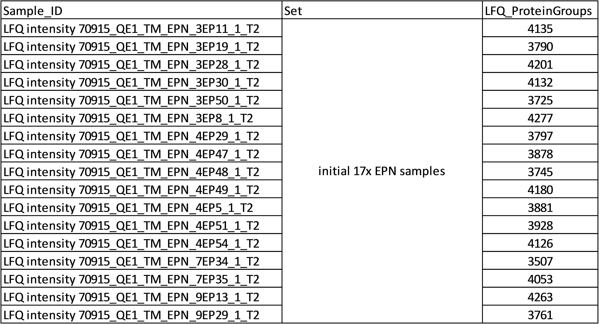

# full_ependymoma_proteomics
Annika Weber 06/2018 

analysis of 111 samples from 8 different tumor subgroups (83 different tumor probes, partly twice measured)
the tumor subgroups were suggested in the paper: 

### Sample Set Summary (for the 111 samples)
- 17x EPN samples (pilot project, only the Top2 - 1st measured technical replicate out of 3)
- Extra 83x EPN samples (66 new and 17 replicates of the pilot samples; started again from tissue)
- 1x (R1-2_7EP5) technical injection of “LFQ intensity 80416_QE1_TM_fullEPN_7EP5”
- 10x EPN83 replicates (starting from same tissue again; due to low ID rate or overall low performance) 

### Files
- `README.md`
- `Notebook_83samples.Rmd` -- R Notebook, shows how to load the data (peptides table for the 111 samples (including pilot data and technical replicates), MaxQuant, is the only data required), prepare the data for working with it and some analysis (correlation pilot and new 17 samples, correlation 10 technical replicates with originals, normalization, clustering with tsne, heatmaps of most differing peptides)
- `Notebook_83samples.nb` -- HTML Version of the R Notebook (83 samples)
- `Notebook_17samples.Rmd` -- R Notebook (this Notebook was coded first, when there was only the pilot data of the first 17 samples was available), shows how to load the data (peptides table for the 17 samples (pilot data), MaxQuant, is the only data required), prepare the data for working with it and some analysis (focus on missing values analysis considering the type of identification, MS/MS vs. Matching, some clustering regards the two tumor subgroups PFA and RELPOS)
- `Notebook_17samples.nb` -- HTML Version of the R Notebook (17 samples)
- `Sample_summary.pptx` -- PowerPoint Presentation with information about the naming and classification of the samples

